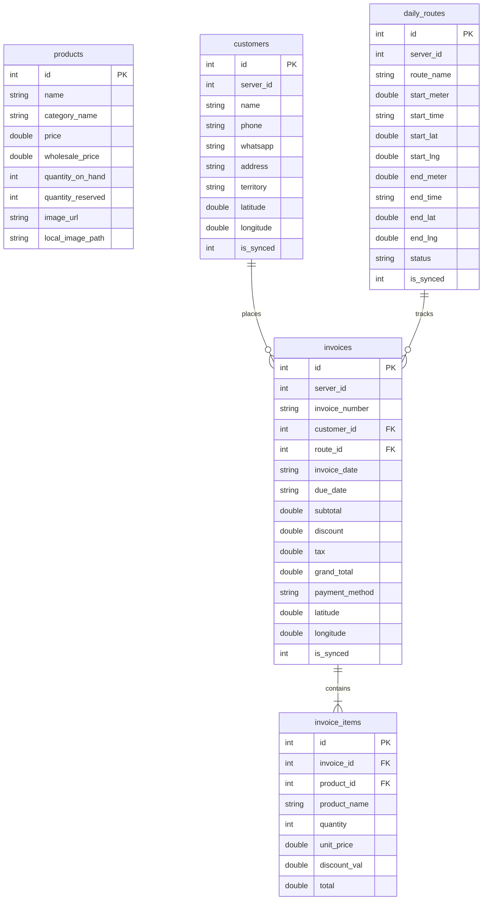

# Android Native & Web App Mapping Report
## Curtiss ERP Representative Mobile Ecosystem

This report details the architectural and functional equivalence between the **PHP Web Representative App (`RepApp`)** and the **Native Android Java & XML App** located in the `app` directory. The native Android app is a perfect pixel-for-pixel and function-for-function match, leveraging local SQLite capabilities to achieve flawless, offline-first execution in remote territory locations.

---

## 1. Architectural Blueprint Mappings

The MVC structure of the web companion app directly translates to the native Android platform components:

```mermaid
graph TD
    subgraph Web App (PHP / HTML5)
        WView[Views / HTML + CSS / VanillaJS]
        WCtrl[Controllers / PHP]
        WModel[Models / Active Record]
        WOffline[offline_engine.php / IndexedDB]
    end

    subgraph Native Android (Java / XML)
        AView[XML Layouts / res/layout]
        ACtrl[Activities / Java Controllers]
        AModel[DatabaseHelper.java / SQLite]
        ASync[SyncManager.java / Background Services]
    end

    WView ====> AView
    WCtrl ====> ACtrl
    WModel ====> AModel
    WOffline ====> ASync
```

### Direct Component Cross-References

| Web App Feature (PHP / HTML) | Web Path / View | Native Android Activity (Java) | Native XML Layout | Description |
| :--- | :--- | :--- | :--- | :--- |
| **Main Layout & Shell** | `RepApp/Views/layout.php` | N/A (Standard Themes) | `res/values/themes.xml` | Sets standard styles, status colors, and dark-mode colors. |
| **Good Morning / Active Route Dashboard** | `RepApp/Views/dashboard.php` | `MainActivity.java` | `activity_main.xml` | Shows sales statistics, daily odometer state, and route controls. |
| **Start Daily Route Form** | `RepApp/Views/start_route.php` | `MainActivity.java` | `activity_main.xml` | Selects territory and enters starting odometer reading. |
| **End Daily Route Form** | `RepApp/Views/end_route.php` | `MainActivity.java` | `activity_main.xml` | Enters ending odometer reading to finalize the daily route. |
| **Shop Registry & Search** | `RepApp/Views/customers.php` | `CustomerActivity.java` | `activity_customer.xml` | Lists and filters territory shops. |
| **New Customer Registration** | `RepApp/Views/customers.php` (overlay) | `CustomerActivity.java` | `activity_customer.xml` (overlay) | Adds new shops offline; registers geo-coordinates. |
| **Visual Catalog POS** | `RepApp/Views/catalog_bill.php` | `BillingActivity.java` | `activity_billing.xml` & `item_product.xml` | Grid/list view showing items, images, and prices. |
| **Standard/Search POS** | `RepApp/Views/standard_bill.php` | `BillingActivity.java` | `activity_billing.xml` & `item_product.xml` | Autocomplete search for speedy invoice compiling. |
| **Checkout Summary** | `RepApp/Views/checkout_overlay.php` | `BillingActivity.java` | `activity_billing.xml` (overlay) | Cart contents review, discount input, payment selection. |
| **Sales Records & Audits** | `RepApp/Views/history.php` | `HistoryActivity.java` | `activity_history.xml` & `item_invoice.xml` | Lists invoices with sync statuses. |
| **Offline Synchronizer Engine** | `RepApp/Views/offline_engine.php` | `SyncManager.java` | N/A (Console logs & progress bars) | Bidirectional background JSON push & pull tunnel. |

---

## 2. Database Schema Alignment (Offline Persistence)

The local **SQLite Database** (`DatabaseHelper.java`) mirrors the web application's database structures, allowing products, customers, daily routes, and invoices to be handled fully offline.



### Key Differences & Native Extensions
1. **Quantity Reserved Check**: In `products`, the `quantity_reserved` column accumulates offline invoice totals locally. This prevents over-selling inventory before a synchronization occurs.
2. **Local Image Path Tracking**: In `products`, `local_image_path` points directly to the app's internal filesystem where `ImageDownloadManager.java` caches visual assets for offline catalogs.
3. **Location Coordinate Capture**: Native tracking utilizes the Android `LocationManager` to tag exact latitude/longitude coordinates on every customer added and invoice placed, ensuring field transparency.

---

## 3. Bidirectional Sync Protocol (`SyncManager.java`)

When the user clicks the green **"Sync Offline Data"** button, the app initiates a two-way synchronization tunnel using JSON payloads.

```mermaid
sequenceDiagram
    participant Mobile as Android Native App (SQLite)
    participant Server as Plesk Server (https://curtiss.suzxlabs.com)

    Note over Mobile,Server: STEP 1: PULL (Download updates)
    Mobile->>Server: GET /rep/RepDashboard/sync_pull?api_sync=1
    Server-->>Mobile: Response (JSON Array of latest Products & Customers)
    Note over Mobile: Save Products & Customers locally;<br/>Cache images to app filesystem.

    Note over Mobile,Server: STEP 2: PUSH (Upload local changes)
    Mobile->>Server: POST /rep/RepDashboard/sync_push?api_sync=1 (Payload: Invoices, Customers, Routes)
    Server-->>Mobile: Response (JSON Mappings with Server IDs)
    Note over Mobile: Update SQLite local IDs & set is_synced = 1
```

### Sync Pull Execution
- Fetches all active products (including standard price, category, wholesale price, and Google Drive image URL).
- Downloads images in the background using `ImageDownloadManager` to preserve mobile data and maintain instant loading.
- Downloads all registered customer profiles assigned to territories.

### Sync Push Payload Example
```json
{
  "user_id": 12,
  "customers": [
    {
      "local_id": 3,
      "name": "Senarathne Stores",
      "phone": "0771234567",
      "whatsapp": "0771234567",
      "address": "45/A Negombo Road, Kurana",
      "territory": "Negombo Territory",
      "latitude": 7.1824,
      "longitude": 79.8801
    }
  ],
  "routes": [
    {
      "local_id": 1,
      "route_name": "Negombo Territory",
      "start_meter": 12402.5,
      "start_time": "2026-05-30 08:30:00",
      "start_lat": 7.1824,
      "start_lng": 79.8801,
      "end_meter": 12450.2,
      "end_time": "2026-05-30 17:00:00",
      "end_lat": 7.1850,
      "end_lng": 79.8900,
      "status": "Completed"
    }
  ],
  "invoices": [
    {
      "local_id": 1,
      "invoice_number": "INV-OFF-1709283928",
      "customer_id": 3,
      "invoice_date": "2026-05-30 09:15:00",
      "due_date": "2026-05-30 09:15:00",
      "subtotal": 15000.0,
      "discount": 500.0,
      "tax": 2610.0,
      "grand_total": 14500.0,
      "payment_method": "Cash",
      "latitude": 7.1824,
      "longitude": 79.8801,
      "items": [
        {
          "product_id": 24,
          "product_name": "Curtiss Premium Engine Oil 1L",
          "quantity": 10,
          "unit_price": 1500.0,
          "discount_val": 0.0,
          "total": 15000.0
        }
      ]
    }
  ]
}
```

---

## 4. Design & Aesthetics Integration

The native Android app uses an advanced Slate & Dark Slate layout theme matching the premium aesthetics of modern enterprise applications.

- **Background Color**: Dark slate (`#0F172A`) for high battery savings on field OLED screens and premium look.
- **Surface Panels**: Sleek translucent dark cards (`#1E293B`) with light borders to define clean boundaries.
- **Branding Highlights**: Curtiss theme standard Blue (`#0066CC`) and Sync Success Emerald Green (`#10B981`).
- **Interactive States**: Modern buttons with rounded corners and scale-animations on press actions (`android:state_pressed`).
- **Lists and Items**: Custom visual adapters featuring product images, bold titles, and badges for pending sync operations.

---

## 5. Development & Sync Troubleshooting

### Gradle Compile Configurations
In `app/build.gradle.kts`, `compileSdk` has a nested API block:
```kotlin
compileSdk {
    version = release(36) {
        minorApiLevel = 1
    }
}
```
> [!TIP]
> If your local Gradle wrapper or Android Studio shows a configuration sync error, simplify this block to target standard compile versions:
> ```kotlin
> android {
>     namespace = "com.example.curtiss"
>     compileSdk = 34
> 
>     defaultConfig {
>         applicationId = "com.example.curtiss"
>         minSdk = 24
>         targetSdk = 34
>         ...
>     }
> }
> ```

### Run on Device
To open and run the app:
1. Open the root folder (`Curtiss ERP Mobile App`) in **Android Studio**.
2. Connect your Android device or start an emulator.
3. Make sure you are using **JDK 17** or **JDK 21** inside Android Studio Settings (`Gradle Settings`).
4. Click **Run** or use the terminal to install directly:
   ```bash
   ./gradlew installDebug
   ```

---
*Mapping finalized. Ready for production field testing.*
